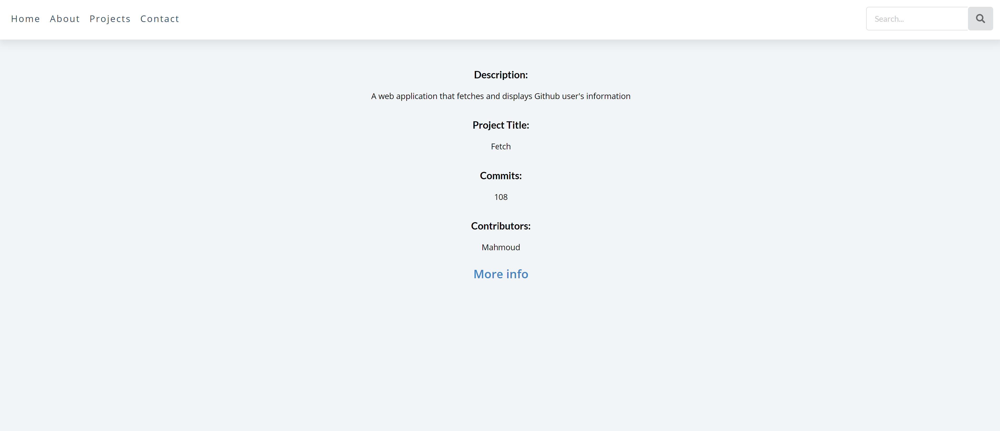

# Fetch

A web application that fetches and displays Github user's information

## To run this project

Set environment variable

> export GITHUB_API_TOKEN=XXXX
> nodemon server.js

To run project
```
cd github-react & npm start/yarn start
```
To create a production build
```
node start
cd github-react & yarn build
```

## Technologies used
```
Node - JS runtime
Express - server
Reactjs - front-end
Nodemon - devserver(watch server)
Prettier - format code
Eslint - look for errors

Mocha - to run tests
Chai - to write tests
Chai-http - server testing
```
## Done

Github project api

Load user info

    id

    name

    picture

    projects

        id

        name

        url

Load Project info for user

    title

    description

    commits

    contributors



